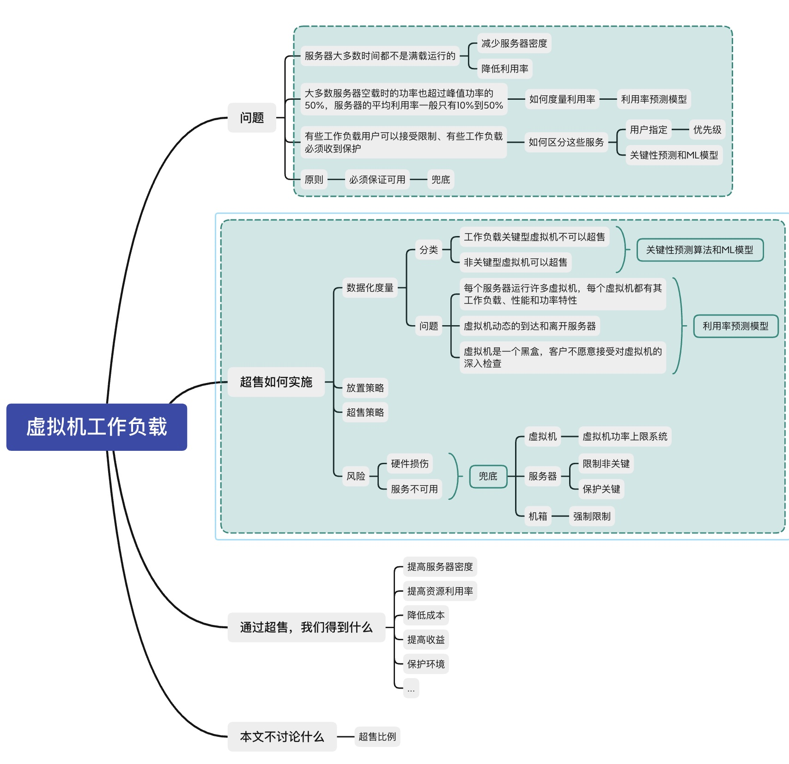
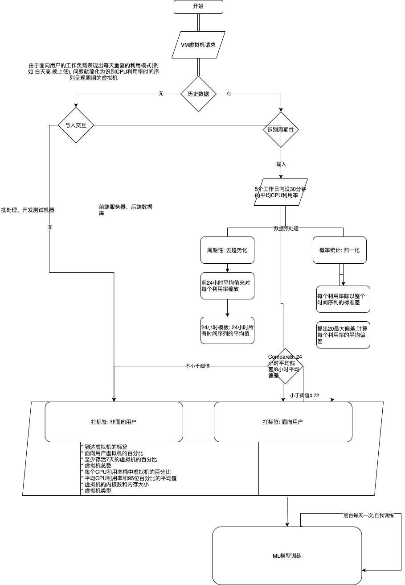
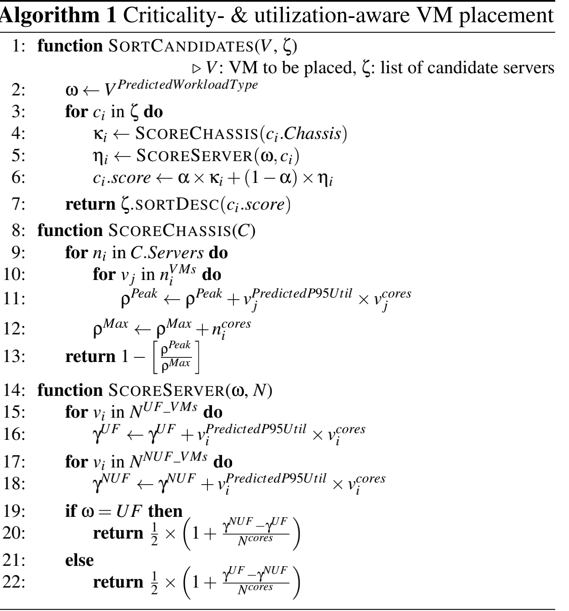

## 基于预测的云平台电力超售
微软研究院和微软Azure

--

- [基于预测的云平台电力超售](#基于预测的云平台电力超售)
- [背景](#背景)
  - [引子&航空超售](#引子航空超售)
- [总体流程](#总体流程)
- [关键度预测&ML模型](#关键度预测ml模型)
- [利用率预测](#利用率预测)
- [放置策略](#放置策略)
- [超售策略](#超售策略)
- [实验&结论](#实验结论)

---

## 背景

有数据统计,云计算的耗电量已经超过全球总耗电量的1%

* 降低云计算的能耗
* 节约成本
* 提高资源利用率

就从IT负载的的角度来讨论一个解决方案

--

### 引子&航空超售

graph LR;
  Power(电力)==> DataCenter(数据中心);
  DataCenter==> PDU(机架);
  PDU==> Server(服务器);
  Server==> VM(虚拟机);
  VM==> WorkLoad(CPU);

---

## 总体流程
虚拟机调度流程

---

## 关键度预测&ML模型
* 目标: 预测出性能关键型虚拟机
* 简化: 面向用户的虚拟机表现为典型的周期性，识别周期性

* 趋势: 趋势是时间序列水平的长期增加或减少(主要探讨时间序列的长期记忆性，即过去的状态可对现在或将来产生影响)
* 归一化: 对原始范围内的数据进行重新缩放，以使所有值都在0和1的范围内。

---

## 利用率预测
* 目标: 虚拟机95百分位CPU利用率
* 方法: 两阶段模型

* 根据虚拟机标签
* 关键性特征

1. 第一阶段: 分为四个桶 0-25% 26%-50% 51%-75% 76%-100%, 95百分位利用率是否高于50%
2. 第二阶段: 1-2桶, 没有信息.

---

## 放置策略

---

## 超售策略

* 挑战: 如何保障关键服务&平衡成本解决和性能影响
* 目标: 提高服务器密度
* 最大封顶事件率(每周/次)
* 最小核心频率

根据历史估计未来的行为。
1. 估计面向用户的虚拟核心在分配的核心中的历史平 均比例（β）。估计面 向 用 户 （ utilUF） 和不面向用户 （utilNUF）的虚拟机的历史平均P95利用率。
对硬件进行剖析
2. 估计在utilUF和utilNUF下，通过降低核心频率可以减少多 少服务器的功率，分别给定f minUF和f minNUF。这一步产生 两条与频率有关的功耗曲线（每条平均利用率的曲 线）
根据历史数据计算功率预算。 
3. 按降序排列历史上的机箱级耗电量（每单位时间每 个机箱读一次）
4. 从最高的功率消耗开始作为第一个候选预算，并逐 步考虑较低的消耗，直到我们找到Pmin。对于每个候选的 功率预算，我们检查封顶事件的速率不会超过f maxUF或f maxNUF（考虑到已经检查过的较高的抽水），并且在在给定的β和第2步的曲线下，从封顶中获得的可持续的 功率降低是足够的。
5. 为了计算最终预算，在第4步的预算中加入一个缓冲 区（例如10%），以考虑未来β的变化或机箱利用率的大 幅增加。

---

## 实验&结论
在Azure生产环境中部署了我们的系统并进行实验
结果表明: 我们的方案可以超售2倍。

